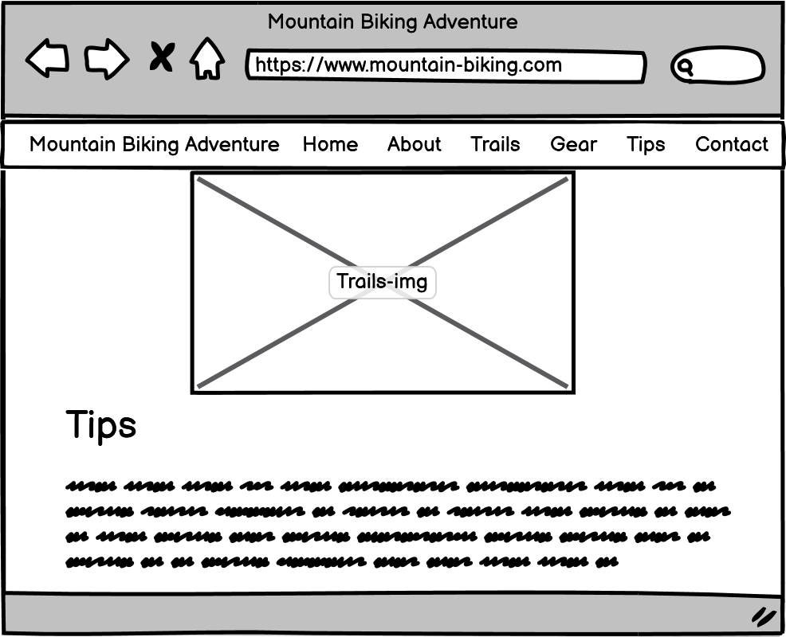

# Mountain Bike Adventure

I build this website for my first project (Project 1) at Code Institute Aug 2023

https://poes93.github.io/Mountain-Biking-Webpage/

---

## CONTENTS

* [User Experience](#user-experience-ux)
  * [User Stories](#user-stories)

* [Design](#design)
  * [Colour Scheme](#colour-scheme)
  * [Typography](#typography)
  * [Imagery](#imagery)
  * [Wireframes](#wireframes)

* [Features](#features)
  * [General Features on Each Page](#general-features-on-each-page)
  * [Future Implementations](#future-implementations)
  * [Accessibility](#accessibility)

* [Technologies Used](#technologies-used)
  * [Languages Used](#languages-used)
  * [Frameworks, Libraries & Programs Used](#frameworks-libraries--programs-used)

* [Deployment & Local Development](#deployment--local-development)
  * [Deployment](#deployment)
  * [Local Development](#local-development)
    * [How to Fork](#how-to-fork)
    * [How to Clone](#how-to-clone)

* [Testing](#testing)

* [Credits](#credits)
  * [Code Used](#code-used)
  * [Content](#content)
  * [Media](#media)
  * [Acknowledgments](#acknowledgments)

---

## User Experience (UX)

### User Stories

Why This Website Exists

As an avid mountain biker, I recognized the need for a comprehensive, one-stop resource for all things related to mountain biking — be it tips, trails, gear, or community. I created this website to serve as a hub for both beginners and experts alike, providing valuable insights and fostering a sense of community among mountain biking enthusiasts.

User Stories

First-Time Visitors
Discover What Mountain Biking Is About: As a first-time visitor, you may not know much about mountain biking. The "About" section provides a detailed overview of the sport, its history, and its connection with nature.
Explore Trails: Interested in hitting the trails? Navigate to the "Trails" section to discover some of the most exciting mountain biking trails around the world.
Gear Up: Not sure what gear you need? The "Gear and Equipment" section outlines all the essential items you'll need for your adventure.
Learn Tips: If you're looking to improve or get started, the "Tips and Techniques" section offers valuable advice that can help you become a better biker.
Connect: Finally, if you have any questions, the "Contact" section allows you to easily get in touch with us.
Journey:

Land on the homepage via the #hero section.
Read the "About" section to get an idea of what mountain biking entails.
Browse through "Trails" to discover exciting places to go biking.
Visit the "Gear" section to know about essential equipment.
Learn some tips from the "Tips" section.
If intrigued, proceed to "Contact" to get in touch for more information.
Returning Visitors
Stay Updated: Regular visitors can look forward to updated lists of trails and fresh tips, ensuring there’s always something new to explore.
Share and Connect: The "Contact" section isn't just for queries; it's for sharing your experiences, giving feedback, and even submitting trail recommendations.

## Design

### Colour Scheme

The colors used in the website are:

* #f29b3d: Used as the background color for the body, header, and the nav bar.
* #191919: Used as the color for the main text in the body.
* #6B6B6B: Used for the box-shadow.
* firebrick: Used for the header links and the background color and text color of the form.
* #f6f6f6: Used as the border color for the form input fields.
* #ffffff (or simply white): Used as the text color for the join-button inside the survey form.
* And the primarily used palette that consists of oranges (like #f29b3d), dark colors (like #191919 and #6B6B6B), and the "firebrick" color (#B22222).

### Typography

I've used googles font Noto Sans

[Google Fonts](https://fonts.google.com/) https://fonts.google.com/noto/specimen/Noto+Sans?query=noto+sans

### Imagery

I have used images from https://www.pexels.com

https://www.pexels.com/photo/silhouette-photography-of-biker-on-top-of-hill-1619299/
https://www.pexels.com/photo/man-in-black-and-orange-bicycle-riding-jacket-with-green-off-road-bike-90454/
https://www.pexels.com/photo/man-in-white-and-green-raglan-elbow-sleeved-shirt-biking-at-daytime-733743/
https://www.pexels.com/photo/photo-of-pathway-surrounded-by-fir-trees-1578750/

### Wireframes

## Features

The website is a one page website, with links to the different sections of the page

  * The header and nav bar will follow through the website while scrolling.

  * A footer which contains social media icon links to instagram and goodreads. There is also an envelope icon which takes the user to the contact us page. Icons were used to keep the footer clean and because they are universally recognisable.

  * Each section is a new category and the information about each topic 
    #About Mountain Biking: A Thrilling Adventure on Two Wheels
    #Trails & Destinations: Your Path to Mountain Biking Euphoria
    #Gear and Equipment
    #Tips and Techniques
    #Contact

* There is a form in the bottom for users to send in questions

* Social media links in the bottom of the website

### General features on each page

For a preview of the website on different screens
[amiresponsive](https://ui.dev/amiresponsive?url=https://poes93.github.io/Mountain-Biking-Webpage/)

### Future Implementations

* Future Implementations.
  * More sections and information
  * Times and schedules
  * Better allignment of the navbar to title text
  * Better allignemnt of the text sections 
  * Style the form section to better match the rest of the website 

### Accessibility

* Icons with ARIA labels: To ensure that screen readers can understand the content 
* Contrast Requirements: The use of easy colors and easy to read and see elements
* Dyslexia/Accessible Friendly Fonts: The font used is easy to read

## Technologies Used

### Languages Used

HTML and CSS were used to create this website.

### Frameworks, Libraries & Programs Used

Balsamiq - Used to create wireframe.

Github - To save and store the files for the website.

Google Fonts - To import the fonts used on the website.

Font Awesome - For the iconography on the website.

Google Dev Tools - To troubleshoot and test features, solve issues with responsiveness and styling.

Visual Studio Code - IDE

Pexel.com - For images

Am I responsive? - To show the image on different devices

## Deployment & Local Development

### Deployment

The site is deployed using GitHub Pages - Mountain-Biking-Webpage.

To Deploy the site using GitHub Pages:

Login (or signup) to Github.
Go to the repository for this project, Poes93/Mountain-Biking-Webpage.
Click the settings button.
Select pages in the left hand navigation menu.
From the source dropdown select main branch and press save.
The site has now been deployed, please note that this process may take a few minutes before the site goes live.
### Local Development

#### How to Fork

To fork the repository:

Log in (or sign up) to Github.
Go to the repository for this project, Poes93/Mountain-Biking-Webpage
Click the Fork button in the top right corner.

#### How to Clone

To clone the repository:

Log in (or sign up) to GitHub.
Go to the repository for this project, Poes93/Mountain-Biking-Webpage
Click on the code button, select whether you would like to clone with HTTPS, SSH or GitHub CLI and copy the link shown.
Open the terminal in your code editor and change the current working directory to the location you want to use for the cloned directory.
Type 'git clone' into the terminal and then paste the link you copied in step 3. Press enter.

## Testing

W3C Validator

### Bugs

These are the current bugs on the website. I can't seem to find out how to currently solve them but they most goes down to the Navbar and header part

* When opening the page on mobile the nav menu is already open and to close it one need to press the bars to close the menu. Same when pressing the links, the menu wont disapear automatically. 

* Scaling for Hero image and position may differ on webrowser but also needs more adjustment on phone.

* Header text wont adjust evenly when on different screen sizes.

* When pressing the links as the header is always on top and the links goes to the section header, it will be hidden under the header.

* Some issues with scaling the nav bar that it sometimes disapears. Reload the page will solve that issue for now.

## Credits

### Code Used
I've used parts of Love Running nav menu and media querries.

### Content

###  Media
The picture I have taken from Pexels.com.
* Hero image taken by Jahangeer Bm - https://www.pexels.com/photo/silhouette-photography-of-biker-on-top-of-hill-1619299/
* About image by Pixabay - https://www.pexels.com/photo/bicyclist-passing-the-road-near-the-river-163407/
* Gear image by Irene Lasus -https://www.pexels.com/photo/man-in-black-and-orange-bicycle-riding-jacket-with-green-off-road-bike-90454/
* The contact image is taken by Darcy Lawrey - https://www.pexels.com/photo/man-in-white-and-green-raglan-elbow-sleeved-shirt-biking-at-daytime-733743/
* The trails image is taken by James Wheeler - https://www.pexels.com/photo/photo-of-pathway-surrounded-by-fir-trees-1578750/

###  Acknowledgments

Thank you Carolina Leguizamon for the help during this project and also to my mentor Jubril Akolade

