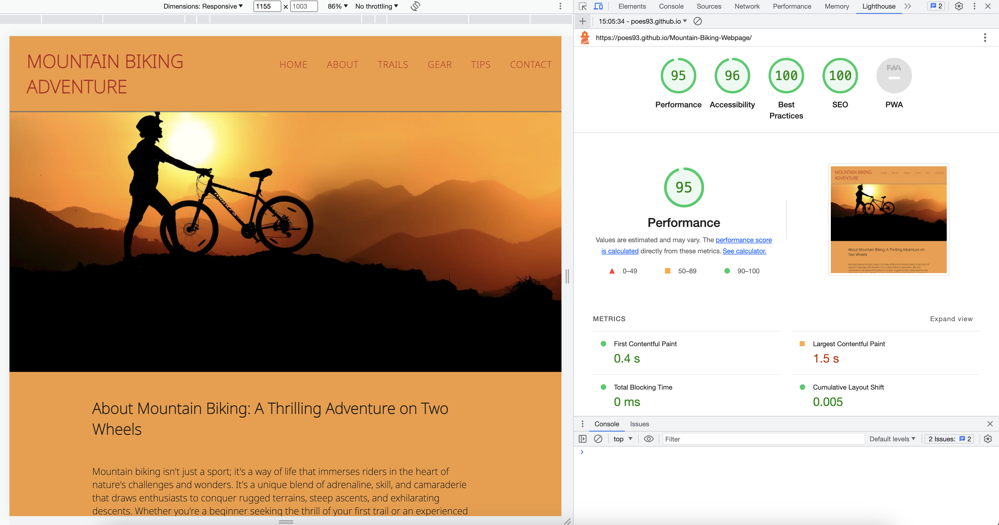
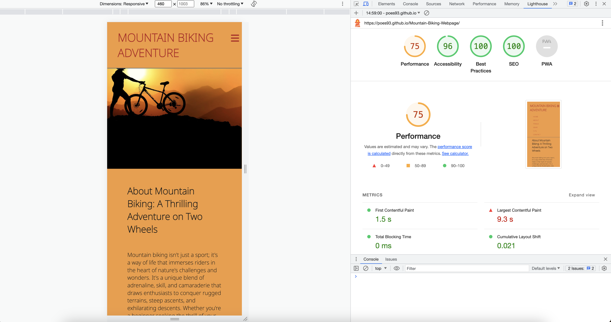

# Mountain Biking Adventure -  Testing

Visit the deployed site: [Mountain Biking Adventure](https://poes93.github.io/Mountain-Biking-Webpage/
)

- - -

## CONTENTS

* [AUTOMATED TESTING](#automated-testing)
  * [W3C Validator](#w3c-validator)
  * [Lighthouse](#lighthouse)
* [MANUAL TESTING](#manual-testing)
  * [Testing User Stories](#testing-user-stories)
  * [Full Testing](#full-testing)

I used Google Chrome Dev tools during the process and during testing and troubleshooting.

## AUTOMATED TESTING

### W3C Validator

[W3C](https://validator.w3.org/) was used to validate the HTML on the page of the website. It was also used to validate the CSS.

* [index.html](documentation/html_validator.png) - Passed, no errors found. 

* [style.css](documentation/css_validator.png) - Passed, no errors found.

- - -

### Lighthouse

I used Lighthouse within the Chrome Developer Tools to test the performance, accessibility, best practices and SEO of the website.

### Desktop Results

Got a performance of 95, Accessibility of 96, best practices and SEO both scored 100

### Mobile Results
 
Got a performance of 75, Accessibility of 96, best practices and SEO both scored 100

- - -

## MANUAL TESTING

### Testing User Stories

`First Time Visitors`

| Goals | How are they achieved? |
| :--- | :--- |
| I want to learn more about mountain biking | Mountain Biking adveture is trying to keep up with the most recent news and best trails |
| I want the site to be responsive to my device. | The website is deisgned with responsiveness in mind. |
| I want the site to be easy to navigate. | The nav bar is countinious through the website  |

`Returning Visitors`

|  Goals | How are they achieved? |
| :--- | :--- |
| I want to be able to choose a level of difficulty that I feel is appropriate for me, based on my experience from my first visit to the site. | Users are able to select their own level of difficulty before the game begins. Once they have played they are free to select a different level of difficulty for subsequent games. |

`Frequent Visitors`

| Goals | How are they achieved? |
| :--- | :--- |
| I want to be able to adjust the difficulty level to keep improving my knowledge. | Users are able to select their own level of difficulty before the game begins. Once they have played they are free to select a different level of difficulty for subsequent games. |
| I want to be able to log my high scores to see how I am performing. | Users of the site are able to log their high scores to the high scores page. The top ten results will be displayed. |

- - -

### Full Testing

Full testing was performed on the following devices:

* Laptop:
  * Macbook Pro 2021 14 inch screen
* Mobile Devices:
  * iPhone 13 pro.
  

Each device tested the site using the following browsers:

* Google Chrome
* Safari

`Home Page`

| Feature | Expected Outcome | Testing Performed | Result | Pass/Fail |
| --- | --- | --- | --- | --- |
| The Sites title | Link directs the user back to the home page | Clicked title | Home page reloads | Pass |
| Navbar continues while scrolling | Navbar should always be top of the screen | Scrolling on the page | Worked | Pass |
| The links in the navbar goes to right section | To come to each section of the page | Clicked each link | came to each section | Pass |
| Filling out the form | Get a new window with the completed form | Filled out form and sent | Got to Code Institute form page | Pass |
| Social media links | Go to our social media page respectively| --- | --- | --- |
| --- | --- | --- | --- | --- |

